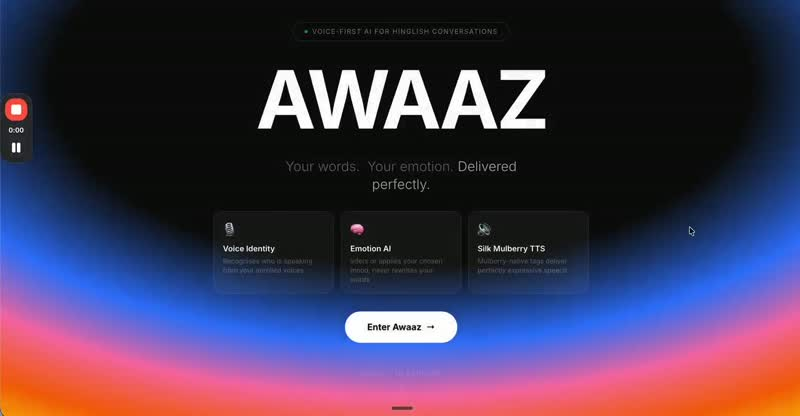

# Awaaz

**A voice for people who can't speak.**

Awaaz gives non-verbal and speech-impaired users a way to talk — sign a gesture or type a thought, and Awaaz turns it into natural, expressive spoken Hinglish. Not a flat text-to-speech readout: the right emotion, the right tone for who you're talking to, so the voice sounds like *you*, not a robot.

<p align="center">
  <a href="docs/media/demo.mp4">
    
  </a>
  <br>
  <em>Click the thumbnail to watch the demo (opens the video on GitHub).</em>
</p>

<video src="docs/media/demo.mp4" controls width="700" poster="docs/media/demo-poster.jpg">
  Your viewer doesn't render inline video — <a href="docs/media/demo.mp4">open the demo directly</a>.
</video>

---

## What it does

- **Sign language → speech** — a `/ws/sign` pipeline reads Indian Sign Language hand gestures (MediaPipe landmarks → ONNX classifier), expands the recognized sign into a full sentence via LLM, and speaks it aloud — so a signed sentence becomes a spoken one, in real time.
- **Expressive, not robotic** — output isn't a flat TTS readout. Emotion tags (laughing, sad, excited, sarcastic, whispering...) are inserted so the spoken voice actually carries feeling.
- **Relationship-aware tone** — the same message is phrased differently for a parent vs. a friend, so communication feels natural to who's on the other end, not generic.
- **Also works from voice** — if you *can* speak but want your words re-expressed with feeling, the same pipeline accepts spoken audio too.
- **Fast enough for real conversation** — streamed end-to-end over WebSockets, first audio chunk in under 3 seconds. See [OPTIMIZATIONS.md](OPTIMIZATIONS.md) for the full 46s → 7s latency story.

## Architecture

```
  ISL hand landmarks ──▶ ONNX sign classifier ──▶ LLM expands to sentence ──▶ TTS ──▶ spoken audio
  (MediaPipe)                                      + emotion tags

  spoken audio (optional) ──▶ STT ──▶ LLM (tags emotion) ──▶ TTS ──▶ spoken audio
```

| Layer | Tech |
|---|---|
| API | FastAPI, WebSockets |
| Sign recognition | ONNX Runtime, MediaPipe hand landmarks |
| STT (voice input path) | Groq Whisper (turbo) / Sarvam Saaras v3 (codemix) |
| LLM | Groq Llama 3.3 70B Versatile — expands signs to sentences, tags emotion |
| TTS | Silk Mulberry (`silk-api.rumik.ai`) — expressive voice synthesis |
| Ambient pipeline | Pipecat |
| Frontend | React + TypeScript + Vite + Tailwind |

### Endpoints

| Endpoint | Purpose |
|---|---|
| `WS /ws/sign` | ISL landmarks in → classified sign → LLM-expanded sentence → spoken audio out |
| `WS /ws/voice` | Streamed pipeline: audio in → transcript → LLM tokens → TTS audio out, pipelined |
| `WS /ws/ambient` | Always-on ambient microphone pipeline (Pipecat) |
| `POST /pipeline/process` | Upload audio → STT + speaker ID → LLM, returns a session for approval |
| `POST /pipeline/approve` | Approve the LLM text → synthesize final TTS audio |
| `POST /pipeline/deny` | Regenerate the LLM response with overrides |
| `POST /pipeline/save-speaker` | Save a voice profile from the current session's audio |

## Getting started

```bash
# 1. Install dependencies
pip install -r requirements.txt

# 2. Copy environment config
cp .env.example .env   # fill in GROQ_API_KEY, SILK_API_KEY

# 3. Run onboarding — builds a personality profile (voice tone, energy, style)
python onboarding_cli.py

# 4. Start the API
uvicorn main:app --reload --port 8000
```

Then open **http://localhost:8000** for the built-in UI, or **http://localhost:8000/docs** for interactive API docs.

Frontend dev server (optional, hot-reload):

```bash
cd frontend
npm install
npm run dev   # http://localhost:5173
```

## Project structure

```
api/            route handlers (pipeline, websockets, onboarding)
core/           config, schemas, user profile, session store
llm/            Groq LLM service — sentence expansion + emotion tagging
stt/            Groq/Sarvam speech-to-text (voice input path)
tts/            Silk Mulberry text-to-speech
speaker/        SpeechBrain speaker recognition
sign/           ISL sign classifier (ONNX)
pipecat_pipeline/  ambient/streaming pipeline built on Pipecat
frontend/       React + Vite UI
```

See [CLAUDE.md](CLAUDE.md) for a deeper architectural walkthrough and [OPTIMIZATIONS.md](OPTIMIZATIONS.md) for the latency-reduction journey.
